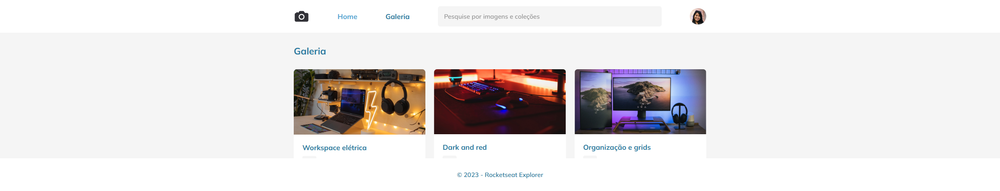

  

 

## 🚀 Tecnologias

Esse projeto foi desenvolvido com as seguintes tecnologias:

- HTML 
- CSS
- Figma

 

## 💻 Projeto
Projeto exclusivo do curso explorer, promovido pela Rocketseat para ensino de tecnologias WEB.

 

## 🔖 Layout

Você pode visualizar o layout do projeto através [DESSE LINK](https://www.figma.com/design/z0v7O5dRq6N3qaW6aXNHnP/Fotoblog-%E2%80%A2-Projeto-Explorer-(Community)?node-id=201-95&p=f&t=BVOVeMWBanlE8Gzi-0).

 

## 🌐 Acesse o projeto
👉 [FotoBlog](https://erika-nicolly.github.io/galery/)

 

Feito com ♥ by Rocketseat :wave: [Participe da nossa comunidade!](https://discord.gg/rocketseat)